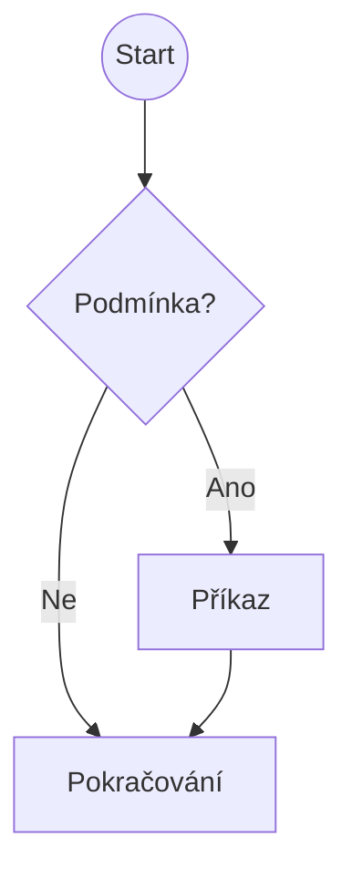
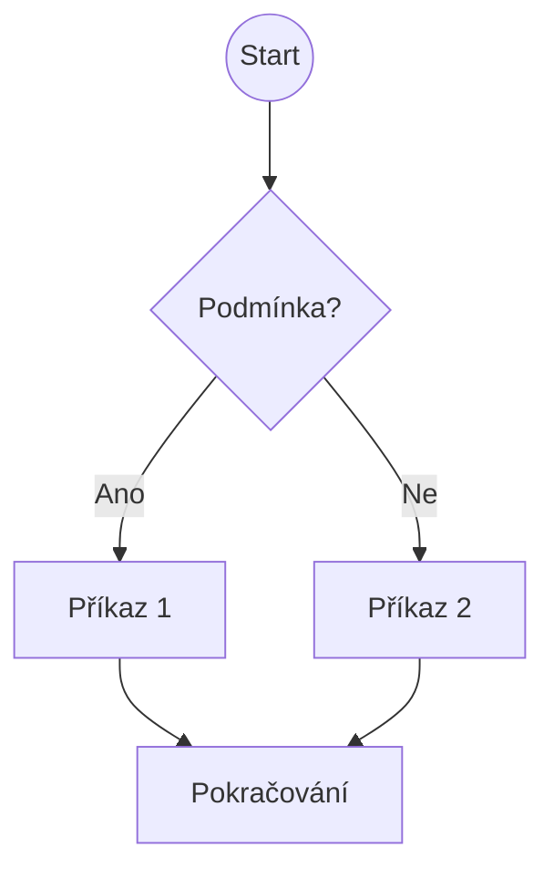

## 1. Typy a charakteristika podmíněných příkazů
Řídící struktury umožňují programu "rozhodovat se" – mění tok výpočtu na základě vyhodnocení logické podmínky. Podmínka je výraz, který vrací logickou hodnotu `True` čili pravdivou (v C nenulové číslo) nebo `False`, čili nepravdivou (v C nula).

Pravdivost hodnoty se odvíjí od fyzického testování nenulovosti bitů v registrech procesoru, více high-level jazyky si pravdivost abstraktujou (např v JavaScriptu je prázdné pole "nepravdivé")
### Základní typy větvení:

1.  **Neúplné větvení (If)**
    *   Obsahuje pouze jednu větev.
    *   Příkazy se provedou jen tehdy, je-li podmínka splněna.
    *   Pokud podmínka neplatí, program pokračuje dál, jako by tam podmínka nebyla.

2.  **Úplné větvení (If – Else)**
    *   Rozděluje program na dvě cesty.
    *   **Větev `if` (kladená):** Provede se při splnění podmínky.
    *   **Větev `else` (záporná):** Provede se při nesplnění podmínky.
    *   Vždy se provede právě jedna z těchto větví.
    
3.  **Vnořené větvení (Else + If)**
	*   V záporné větvi jedné podmínky se nachází bezprostředně podmínka další
	
4.  **Vícenásobné větvení (Switch)**
    *   **Switch (Přepínač):** Specifická konstrukce pro výběr z mnoha možností na základě přesné hodnoty jedné proměnné. Zvyšuje přehlednost kódu oproti mnoha `else-if` .

5.  **Ternární operátor**
	-   Není řídící strukturou, ale operátorem 
    *   Jediný operátor, který má tři operandy.
    *   Celý výraz nabývá hodnoty na základě pravdivého/nepravdivého rozhodnutí

---

## 2. Grafický zápis – vývojový diagram
Ve vývojových diagramech (flowcharts) se pro větvení používá symbol **kosočtverce**.
*   Do kosočtverce se píše podmínka.
*   Z kosočtverce vycházejí dvě šipky označené jako kladná větev `+` (Ano/True) a záporná větev `-` (Ne/False).

### Neúplné větvení


### Úplné větvení


### Switch (přepínač)
Graficky se znázorňuje jako kosočtverec (nebo více kosočtverců), ze kterého vede více větví pro konkrétní hodnoty.

---

## 3. Zápis v jazyce C a Java
Syntaxe větvení je v jazycích C a Java téměř identická.

### Podmínka IF a ELSE
Základní syntaxe je stejná pro oba jazyky. Bloky kódu se uzavírají do složených závorek `{}`. Pokud blok obsahuje jen jeden příkaz, závorky nejsou nutné (ale doporučují se).

```c
// C i Java
if (cislo > 0) {
    printf("Cislo je kladne"); // V Javě: System.out.println(...)
} else if (cislo < 0) {
	printf("Cislo je zaporne");
} else {
	printf("Cislo je nula");
}
```

*Poznámka: Je nutno si uvědomit, že výraz `else if` je pořád vnořeným větvením a poslední `else` v tomto případě je záporná větev druhé podmínky `cislo < 0`, syntaxe céčkových jazyků (C i Java) nám umožňuje definovat zápornou větev jako pouze jednu instrukci místo kódového bloku, v tomto případě je jedinou instrukcí v záporné větvi první podmínky `cislo > 0` další podmínka `cislo < 0`*

*Poznámka: I když některé jazyky (Python) mají pro `else if` speciální klíčové slovo nebo chování (`elif` v případě Pythonu), C a Java nemají pro `else if` žádné speciální chování a jde pouze o zkrácení `else { if `*
### Příkaz SWITCH
Slouží k větvení podle hodnoty celočíselné hodnoty (int, char, atd.).
*   **Klíčové slovo `break`:** Je nutné pro ukončení větve. Bez něj by program "propadl" (fall-through) do další větve a vykonal i její kód.
*   **Klíčové slovo `default`:** Vykoná se, pokud žádný `case` neodpovídá (obdoba `else`).

**Rozdíl C vs Java:**
*   **C:** `switch` funguje jen pro celočíselné (ordinální) datové typy. (`int`, `char`)
*   **Java:** `switch` taktéž porovnává celočíselné hodnoty, v případě nečíselných datových typů jako `String`, celočíselnou hodnotu jenž porovnává je její "hashkód".

```java
// Ukázka v Javě (v C by nefungoval např String)
int volba = 2;

switch (volba) {
    case 1:
        System.out.println("Volba 1");
        break; // Důležité!
    case 2:
        System.out.println("Volba 2");
        break;
    default:
        System.out.println("Neznámá volba");
        break;
}
```

### Ternární operátor
Syntaxe: `(podmínka) ? hodnota_pokud_true : hodnota_pokud_false`
Nabývá hodnoty na základě pravdivého/nepravdivého rozhodnutí.

```c
// C i Java
int a = 10, b = 20;
// Pokud je a > b, max bude a, jinak bude b
int max = (a > b) ? a : b; 
```
